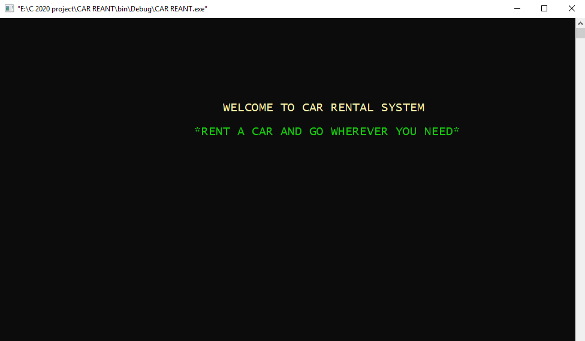
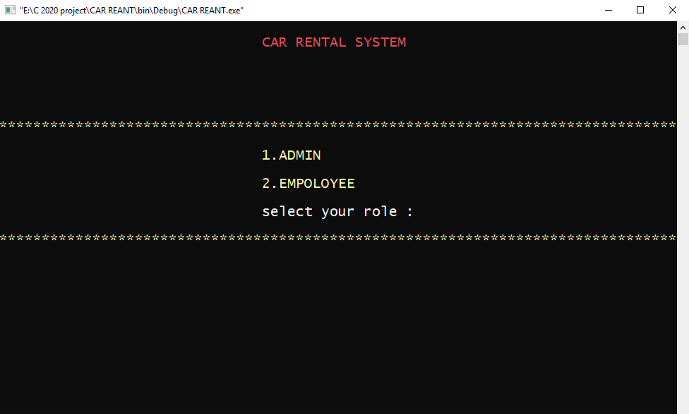
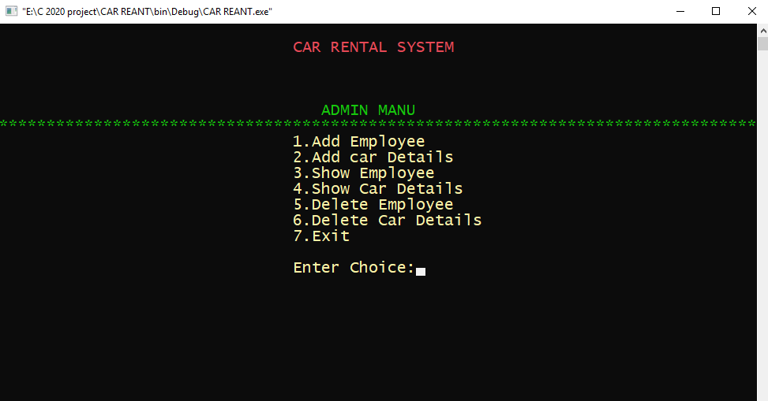
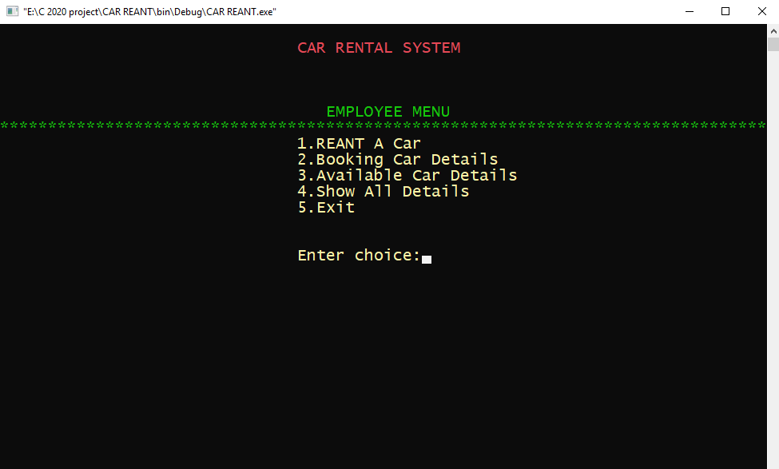

# **CITY CAR RENTAL Project**

TOTAL SCREENS IN THE PROJECT

1. **Main Screen**
2. **Login Screen**

**A. Admin Screen**
		
1. Add Employee
2. View Employee
3. Add Car 
4. View Car
5. Delete Employee
6. Delete Car
7. Exit

**B. Employee Screen**

1. Rent A Car
2. Booking Details
3. Available Car Details
4. Show All Car Details
5. Exit

THE MAIN SCREEN AND OPTION SCREEN
============================================================================================

 *Add support of conio2.h in our project*
1. Create a header file called "car.h" which will contain structure declarations, typedef statements and function declarations
2. Create a source code file called "car.c" which will contain definitions of the functions declared in the file "car.h" 
